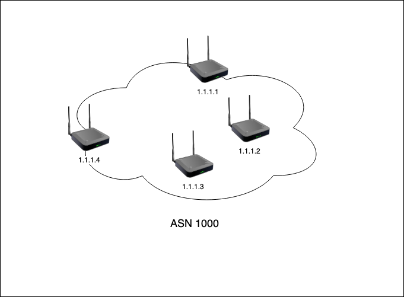
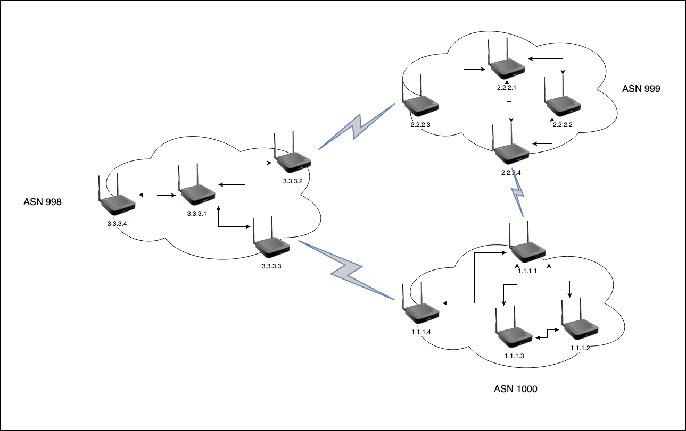
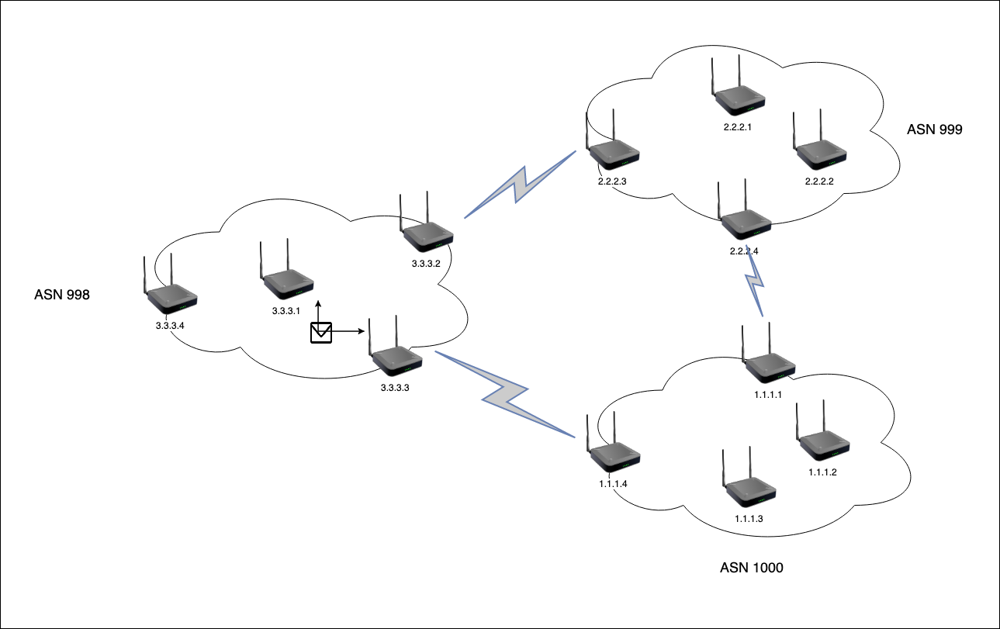
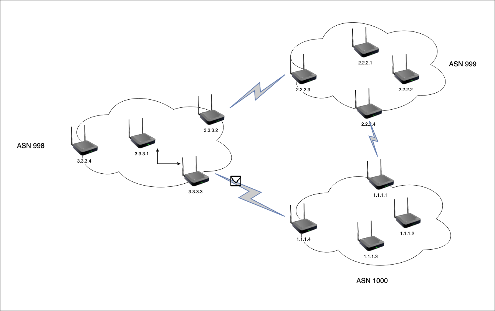
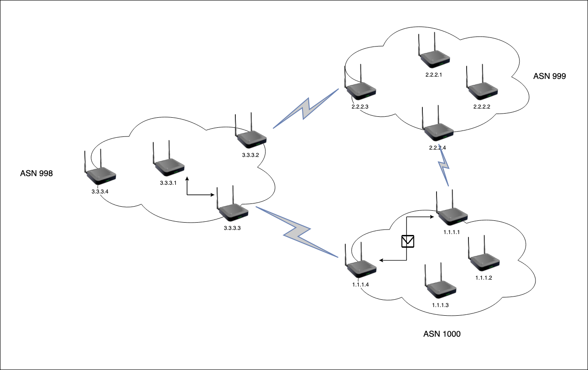
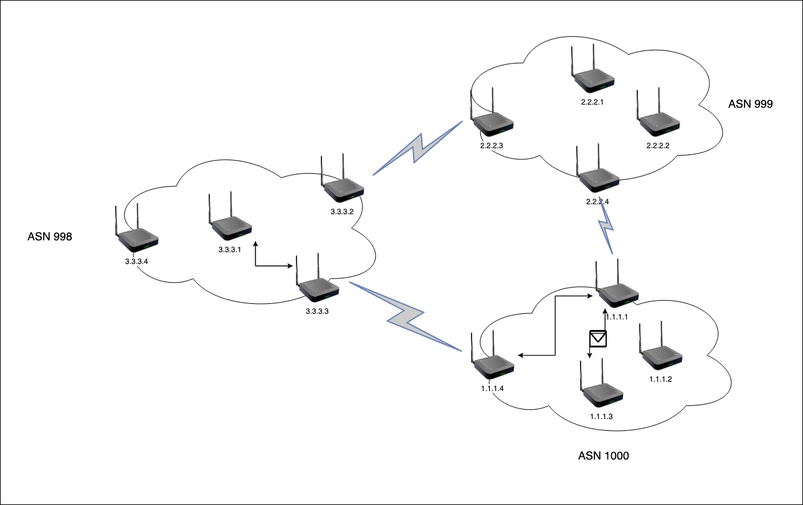

What does it take to own an IP address?!

---

### Agenda:
1. Get an IP address
2. BGP registration
3. Life of a packet

---

Let us procure an IP 

--

How about 127.0.0.1?

--

Nah, that is where I stay! 🏡

--

How about 192.168.1.2?

--

Nah, that is a private IP address and does not need to be procured.  
You can just use it internally!

--

There are a plethora of videos on youtube for Private vs Public IP and this video is not going to discuss about that!  

--

We should go ahead with understanding how a public IP address is procured and how anyone around the world can access it!

---

### IANA 
 Heard of it?
 What is it?

--

`The Internet Assigned Numbers Authority (IANA) is responsible for globally coordinating DNS Root, IP addressing, and other Internet protocol resources, including ASNs.`

--

Regional Internet Registries (RIRs), which are organizations that manage Internet number resources in a particular region of the world.
  
The five regional Internet registries are:

    African Network Information Center (AFRINIC)
    American Registry for Internet Numbers (ARIN)
    Asia-Pacific Network Information Centre (APNIC)
    Latin American and Caribbean Network Information Centre (LACNIC)
    Réseaux IP Européens Network Coordination Centre (RIPE NCC)

--

What is an ASN?

--

Autonomous System Number <=> ASN

--

Let us look a little more than what it stands for!

--

`This number is used both in the exchange of exterior routing information (between neighboring Autonomous Systems) and as an identifier of the AS itself.`

--

`An AS is a group of IP networks operated by one or more network operator(s) that has a single and clearly defined external routing policy.`

--

Check out this [FAQ](https://www.apnic.net/get-ip/faqs/asn/) if you want to know more about ASNs

---

Okay, now that we know these concepts, let us look at what it takes to buy an IP

--

First requirement is to get an ASN from your RIR. **

    
<small><i>**This is not really mandatory</i></small>

--

It is as simple as having unique routing policies, filling a couple of forms and signing a few agreements.
 ARIN has a [video tutorial](https://www.youtube.com/watch?v=3HnjBbzS_jY) for you to do this.

--

Okay, I have an ASN.
  Now what?

--

Show some excitement and request for an IP space.
 ARIN has a [video tutorial](https://www.youtube.com/watch?v=nCm6bLPh-Pw) for this as well.

--

Let us see what it might approximately cost us 🤔

--

--

And finally, we have an IP address!

--

Oh, want to guess how long it might take to get an IPv4 range?
Check out [this](https://www.arin.net/resources/guide/ipv4/waiting_list/) waiting list!!!

---

Now is the right time to talk about BGP peering and advertisements

--

First thing is to peer our Autonomous systems with other Autonomous systems. This is done by something called BGP peering.

--

We have to peer with other AS's so that we can tell that we own a range of IPs and they will forward any traffic that comes to that IP to us.
  By peering, we also agree to participate in routing and help others receive their packets as well.

--

Let us look at some live examples of BGP peers [here](https://stats.apnic.net/vizas/)

--

Once you have peered with other AS's, they expect you to only advertise IP ranges that you own.

--

Since we do not own any IP/ASN at this point in time, let us assume that we have been allocated 1.1.1.0/24 (1.1.1.1 to 1.1.1.254) and our ASN is 1000

--

We have 4 web applications and we will be using the first 4 IPs for them.

--

--

It is now time for us to make new friends and peer with them.

--

--

We basically want our IP to be advertised/announced so that other routers know where to send the traffic coming to that IP.

--

--

Now we are all set for anyone around the world to be able to access our applications.

--

Let us look at a simple packet flow when 3.3.3.1 wants to access the application on 1.1.1.3

--

--

--

--

--

Let us have a look at the realtime AS routes for redhat's website 
  [Click me](https://stat.ripe.net/special/bgplay#bgplay_fetch.resource=209.132.183.105)

---

The internet works on trust and the owner of an ASN needs to take utmost care not to advertise an IP he/she does not own.
Or [this](https://bgpmon.net/popular-destinations-rerouted-to-russia/) happens!! xD

--

Easy to understand BGP hijacking tutorial [here](https://www.cloudflare.com/learning/security/glossary/bgp-hijacking/).

---

Something nice to play around with!!
  [Click me](http://as2914.net/#/?_k=rflk49)

---

